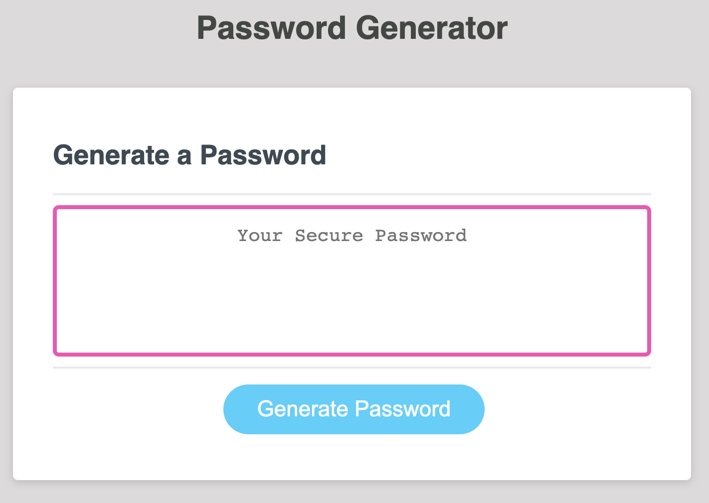

# Week-3-Homework
This is my Week 3 Homework! I've created a password generator that flashes questions at the top of the screen to determine the user's preferences: uppercase and/or lowercase letters, numbers and special characters, the length of the password, then generates!

[hosted-url](https://celestealexmoore.github.io/Week-3-Homework/)
